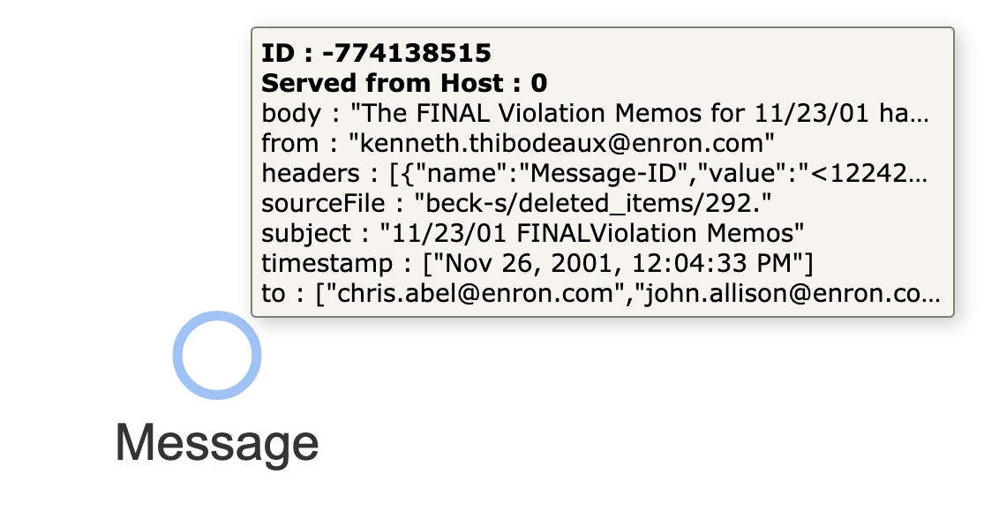
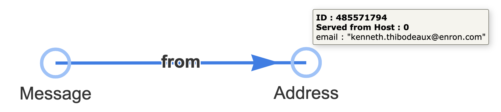
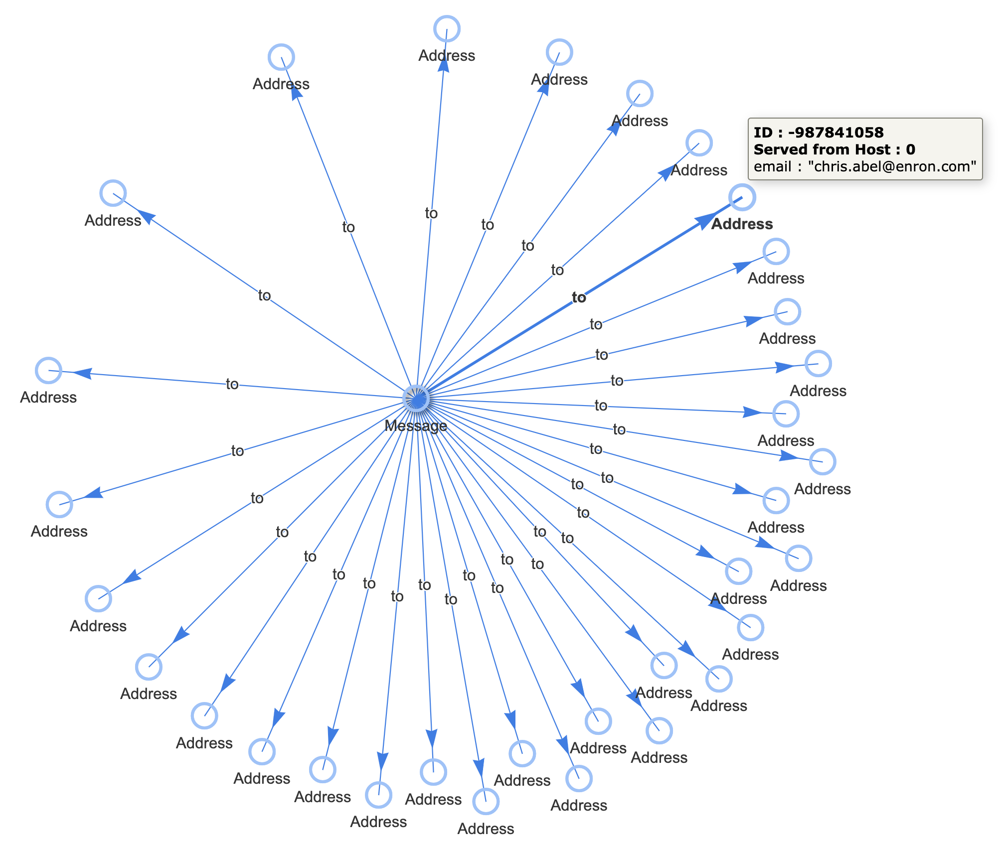
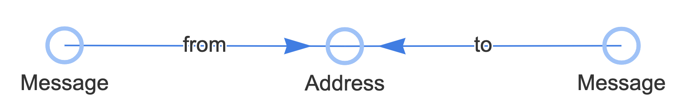
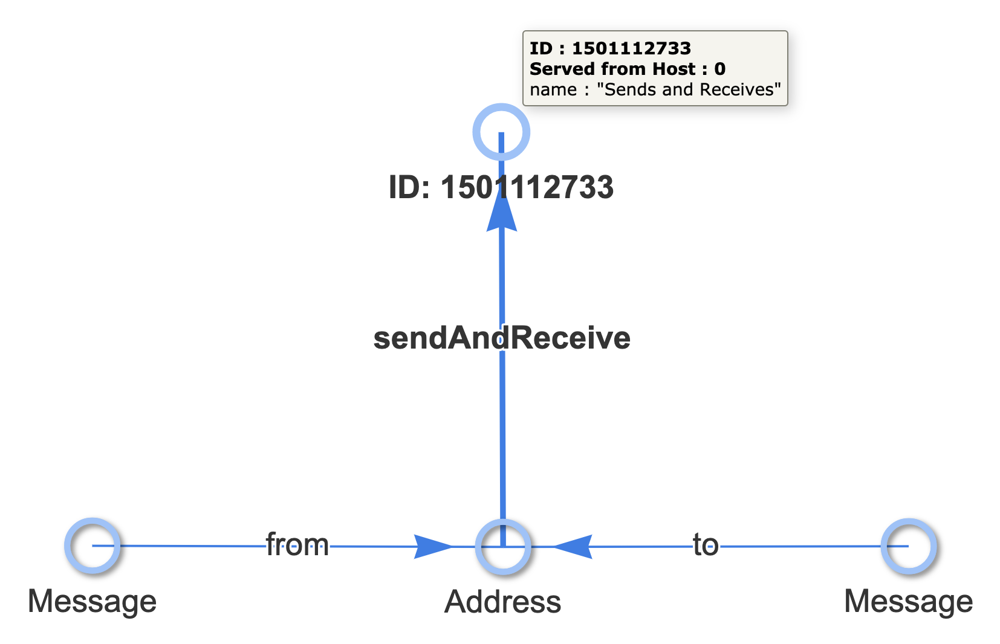

# 3D Data Ingest Tutorial

Finding complex patterns in streaming data requires creating new data elements to represent new types, composite value, judgements, or metrics. As new data streams in, these patterns are recognized immediately by Standing Queries and used to create more meaningful data elements tied to their underlying original data. The result is:

* An interconnected graph of original data loaded into the system
* Associated new data which is smaller in size, but more meaningful
* Many possible “interpretations” of data living together happily in a streaming system.

```raw
<video width="688" height=516 autoplay playsInline muted loop>
<source src="3d_data/3d_data.m4v" type="video/mp4" />
Your browser does not support video playback.
</video>
```

In this tutorial, we will be consuming the public dataset of Enron email messages that were a part of the Enron scandal. Email is ubiquitous and forms a very natural web of interlinked data. But the records in the dataset are simple raw email messages. In this tutorial, we demonstrate how to read and store the original data, connect it into an interesting structure, and produce new data that builds toward answers of interest.

## Step #1: Plan for incoming data structure

The original dataset is in CSV format with the following column headers:

```
"file", "message"
```

The message content is all that interests us for this tutorial, so we’ve processed the data and parsed the message content into JSON with the following structure:

```json
{
  "sourceFile": "",
  "headers": [
    {
      "name": "",
      "value": ""
     }
  ],
  "from": "",
  "to": [],
  "subject": "",
  "timestamp": [],
  "body": ""
}
```

For the ingest steps below, we will make each message a node in a graph. The node ID will be deterministically generated from the email headers field. All JSON fields are stored on the node as key/value pairs (or “properties”) on the respective node. For convenience, each node will be given a label of “Message”.

This ingest plan will create a single node for each email message, entirely disconnected from any other node in the graph. This structure is directly analogous to each email message representing one row of a relational database, where the columns are the JSON object keys.

As we will see later, this can be accomplished with the following Cypher query used to ingest each JSON data record passed in as `$props`:

```cypher
MATCH (n) WHERE id(n) = idFrom('headers', $props.headers)
SET n = $props, n:Message
```

## Step #2: Set Standing Queries

_thatDot Connect_ has the unique ability to set a query which lives inside the graph, propagates automatically, and can trigger arbitrary action immediately for each result found when new data completes the query. Standing Queries can be applied to existing data, or only to new data coming in. In this example, we will use “Universal Standing Queries” which are applied to new data beginning the moment the standing query is issued. We will set the Standing Queries ahead of time and once they are all set up, we will begin ingesting the data.

### Standing Query #1: Connect email address nodes to represent the sender of each message.

Data does not need to begin in a graph structure. Typical row- or column-oriented data is a perfectly fine starting point—as is the de facto standard JSON format. But the building consensus of modern data processing is that connected data is more valuable than disconnected data. We’ll illustrate and make the connections here with a standing query.

We want a standing query that starts with this simple node:



and turns it into this connected set of nodes:



We can accomplish this with a pair Cypher queries—one describing the pattern to find the node of interest:

```cypher
MATCH (n) WHERE exists(n.from) RETURN id(n)
```

and the other describing the action we want to take (creating new data) for each matched result:

```cypher
MATCH (n), (m) WHERE id(n) = $sqMatch.data.id AND id(m) = idFrom('email', n.from)
CREATE (n)-[:from]->(m)
SET m.email = n.from, m:Address
```

When combined together, the following JSON makes up the payload of a `POST` API call to `/api/v1/query/standing/from`

```json
{
  "pattern": {
    "type": "Cypher",
    "query": "MATCH (n) WHERE exists(n.from) RETURN id(n)"
  },
  "outputs": [{
    "type": "CypherQuery",
    "parameter": "sqMatch",
    "query": "MATCH (n), (m) WHERE id(n) = $sqMatch.data.id AND id(m) = idFrom('email', n.from) CREATE (n)-[:from]->(m) SET m.email = n.from, m:Address",
    "parallelism": 2
  }]
}
```

This API call can be issued via the API documentation page at `/docs` or with the following `curl` command at a Unix command line:

```bash
curl -X POST "http://_.dev.thatdot.com/api/v1/query/standing/from" -H  "accept: */*" -H  "Content-Type: application/json" -d "{\"pattern\":{\"type\":\"Cypher\",\"query\":\"MATCH (n) WHERE exists(n.from) RETURN id(n)\"},\"outputs\":[{\"type\":\"CypherQuery\",\"parameter\":\"sqMatch\",\"query\":\"MATCH (n), (m) WHERE id(n) = \$sqMatch.data.id AND id(m) = idFrom('email', n.from) CREATE (n)-[:from]->(m) SET m.email = n.from, m:Address\",\"parallelism\":2}]}"
```

### Standing Query #2: Connect email address nodes to represent the receivers of each message.

Similar to the first standing query, now we want to pull out the email addresses in the “To:” field of each email message and connect the Message node to the nodes corresponding to each email address node. Unlike the “From:” field, there are often many addresses in the “To:” field.

We’d like to take data that looks like this:


And turn it into data like this:



Similar to the first standing query, this can be done with two cypher queries. One to match the Message node, just as before, but with a “to” field:

```cypher
MATCH (n) WHERE exists(n.to) RETURN id(n)
```

and another to update data with the results:

```cypher
MATCH (n) WHERE id(n) = $sqMatch.data.id
WITH n.to AS toAddys, n
UNWIND toAddys AS toAddy
MATCH (m) WHERE id(m) = idFrom('email', toAddy)
CREATE (n)-[:to]->(m)
SET m.email = toAddy, m:Address
```

The following JSON payload can be passed in to the `POST` endpoint at `/api/v1/query/standing/to`

```json
{
  "pattern": {
    "type": "Cypher",
    "query": "MATCH (n) WHERE exists(n.to) RETURN id(n)"
  },
  "outputs": [{
    "type": "CypherQuery",
    "parameter": "sqMatch",
    "query": "MATCH (n) WHERE id(n) = $sqMatch.data.id WITH n.to AS toAddys, n UNWIND toAddys AS toAddy MATCH (m) WHERE id(m) = idFrom('email', toAddy) CREATE (n)-[:to]->(m) SET m.email = toAddy, m:Address",
    "parallelism": 2
  }]
}
```

Or issued via `curl` on the command line:

```bash
curl -X POST "http://_.dev.thatdot.com/api/v1/query/standing/to" -H  "accept: */*" -H  "Content-Type: application/json" -d "{\"pattern\":{\"type\":\"Cypher\",\"query\":\"MATCH (n) WHERE exists(n.to) RETURN id(n)\"},\"outputs\":[{\"type\":\"CypherQuery\",\"parameter\":\"sqMatch\",\"query\":\"MATCH (n) WHERE id(n) = \$sqMatch.data.id WITH n.to AS toAddys, n UNWIND toAddys AS toAddy MATCH (m) WHERE id(m) = idFrom('email', toAddy) CREATE (n)-[:to]->(m) SET m.email = toAddy, m:Address\",\"parallelism\":2}]}"
```

### Standing Query #3: Identify Email Addresses that both send and receive in this dataset.

Analysis of streaming data often requires writing and deploying new microservices which can operate quickly on data streams and persist their results in ways useful to other services. In _thatDot Connect_, this is done with standing queries, just as before.

If we needed to find email addresses which were both sender and receiver in this dataset, we can define a new standing query that checks for that pattern (slightly more interesting than the previous patterns) and creates an edge associated those Address nodes with a new node that represents the set we care about.

We want to find node that look like this:



And turn them into nodes which look like this:



Matching the pattern of interest can be accomplished with the following Cypher query:

```cypher
MATCH (to)-[:to]->(n)<-[:from]-(from) RETURN id(n)
```

And transforming the data can be done with this Cypher query:

```cypher
MATCH (n), (m) WHERE id(n) = $sqMatch.data.id AND id(m) = idFrom('sendAndReceive')
CREATE (n)-[:sendAndReceive]->(m)
SET m.name = 'Sends and Receives'
```

These can be assembled in the following JSON payload to be delivered via `POST` to the endpoint at `/api/v1/query/standing/s-r`

```json
{
  "pattern": {
    "type": "Cypher",
    "query": "MATCH (to)-[:to]->(n)<-[:from]-(from) RETURN id(n)"
  },
  "outputs": [{
    "type": "CypherQuery",
    "parameter": "sqMatch",
    "query": "MATCH (n), (m) WHERE id(n) = $sqMatch.data.id AND id(m) = idFrom('sendAndReceive') CREATE (n)-[:sendAndReceive]->(m) SET m.name = 'Sends and Receives'",
    "parallelism": 2
  }]
}
```

Or issued via `curl` on the command line as follows:

```bash
curl -X POST "http://_.dev.thatdot.com/api/v1/query/standing/s-r" -H  "accept: */*" -H  "Content-Type: application/json" -d "{\"pattern\":{\"type\":\"Cypher\",\"query\":\"MATCH (to)-[:to]->(n)<-[:from]-(from) RETURN id(n)\"},\"outputs\":[{\"type\":\"CypherQuery\",\"parameter\":\"sqMatch\",\"query\":\"MATCH (n), (m) WHERE id(n) = \$sqMatch.data.id AND id(m) = idFrom('sendAndReceive') CREATE (n)-[:sendAndReceive]->(m) SET m.name = 'Sends and Receives'\",\"parallelism\":2}]}"
```

## Step #3: Start Data Ingest

With the desired standing queries established, all new incoming data will advance the overall structure of the system’s data toward the patterns described in those standing queries. As new data comes in and results in matches being produced, the update will be applied automatically—regardless of the order in which the data arrives or the number of matches made, in progress, or incomplete so far.

To start data ingest from an AWS Kinesis stream, we will use the Cypher query mentioned in Step #1 above to write a single node for each incoming JSON record:

```cypher
MATCH (n) WHERE id(n) = idFrom('headers', $props.headers)
SET n = $props, n:Message
```

Note that the ID of each node is generated deterministically based on some of the content (the email headers) which will result in a unique node for each unique header content. Since nodes are defined by their ID alone, duplicate JSON objects received will result in attempts to produce the same content at the same node. The system interprets this as a noop, and no duplicate data will be produced as part of the ingest process or from the standing queries defined above.

With a valid AWS `accessKeyId` and `secretAccessKey`, the following JSON payload can be issued to the `POST` endpoint at `/api/v1/ingest/enron-sample`

```json
{
  "format": {
    "query": "MATCH (n) WHERE id(n) = idFrom('headers', $props.headers) SET n = $props, n:Message",
    "parameter": "props",
    "type": "CypherJson"
  },
  "streamName": "enron-sample",
  "type": "KinesisIngest",
  "iteratorType": "TRIM_HORIZON",
  "credentials": {
    "region": "us-west-2",
    "accessKeyId": "YOUR_ACCESS_KEY_ID",
    "secretAccessKey": "YOUR_SECRET_ACCESS_KEY"
  }
}
```

Or called at the command line with `curl`:

```bash
curl -X POST "http://_.dev.thatdot.com/api/v1/ingest/enron-sample" -H  "accept: */*" -H  "Content-Type: application/json" -d "{\"format\":{\"query\":\"MATCH (n) WHERE id(n) = idFrom('headers', \$props.headers) SET n = \$props, n:Message\",\"parameter\":\"props\",\"type\":\"CypherJson\"},\"streamName\":\"enron-sample\",\"type\":\"KinesisIngest\",\"iteratorType\":\"TRIM_HORIZON\",\"credentials\":{\"region\":\"us-west-2\",\"accessKeyId\":\"YOUR_ACCESS_KEY_ID\",\"secretAccessKey\":\"YOUR_SECRET_ACCESS_KEY\"}}"

```

Upon issuing this REST API call, a Kinesis ingest stream will begin to consume the data in the specified Kinesis instance. Standing Queries #1 and #2 will be automatically applied to the incoming JSON data from Kinesis, and the new data will be created as specified. As that new data is created, it will also trigger matches for Standing Query #3. At each step, data gets more connected and closer to the specific answers desired.

## Step #4: Observe results as they are matched.

_thatDot Connect_ can take many kinds of action when each standing query returns a result. The standing queries shown here updated data. Making use of the results in real-time as it is interpreted with the additional data written in makes the system profoundly powerful. To make use real-time results, a standing query can be configured to publish data back to Kinesis or other event stream systems. Data can be sent out of _thatDot Connect_ into other services or system components providing endless possibilities. The ability to interpret data by drawing connections, defining new levels in the data, and drilling down for answers is powerful!

