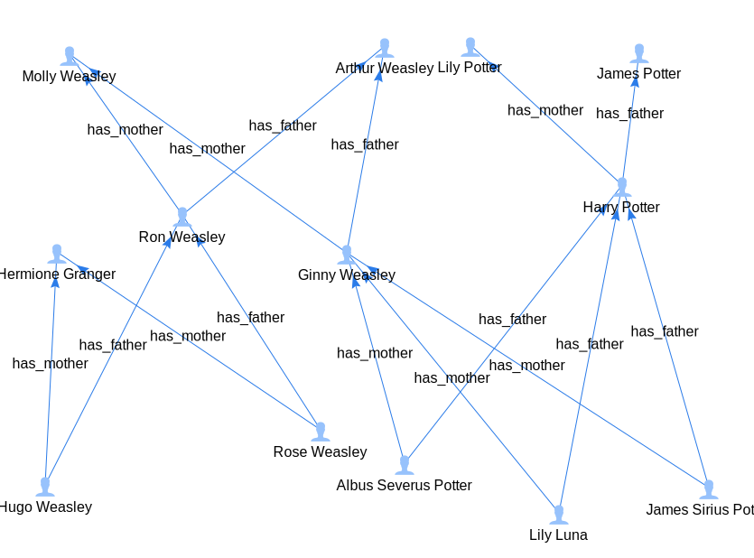

# How to load data?

There are several different ways of writing data into the system, optimized for different use cases.

## Inline queries

For ad-hoc experimenting, it is usually enough to create individual nodes and edges directly with
Cypher queries.

```cypher
CREATE
  (lilysr: Person { name: "Lily Potter", gender: "female", birth_year: 1960 }),
  (jamessr:Person { name: "James Potter", gender: "male", birth_year: 1960 }),
  (molly:Person { name: "Molly Weasley", gender: "female", birth_year: 1949 }),
  (arthur:Person { name: "Arthur Weasley", gender: "male", birth_year: 1950 }),
  (harry:Person { name: "Harry Potter", gender: "male", birth_year: 1980 }),
  (ginny:Person { name: "Ginny Weasley", gender: "female", birth_year: 1981 }),
  (ron:Person { name: "Ron Weasley", gender: "male", birth_year: 1980 }),
  (hermione:Person { name: "Hermione Granger", gender: "female", birth_year: 1979 }),
  (jamesjr:Person { name: "James Sirius Potter", gender: "male", birth_year: 2003 }),
  (albus:Person { name: "Albus Severus Potter", gender: "male", birth_year: 2005 }),
  (lilyjr:Person { name: "Lily Luna", gender: "female",  birth_year: 2007 }),
  (rose:Person { name: "Rose Weasley", gender: "female",  birth_year: 2005 }),
  (hugo:Person { name: "Hugo Weasley", gender: "male",  birth_year: 2008 }),
  (jamessr)<-[:has_father]-(harry)-[:has_mother]->(lilysr),
  (arthur)<-[:has_father]-(ginny)-[:has_mother]->(molly),
  (arthur)<-[:has_father]-(ron)-[:has_mother]->(molly),
  (harry)<-[:has_father]-(jamesjr)-[:has_mother]->(ginny),
  (harry)<-[:has_father]-(albus)-[:has_mother]->(ginny),
  (harry)<-[:has_father]-(lilyjr)-[:has_mother]->(ginny),
  (ron)<-[:has_father]-(rose)-[:has_mother]->(hermione),
  (ron)<-[:has_father]-(hugo)-[:has_mother]->(hermione);
```

This sort of query can be entered in the @ref:[Exploration UI](../usage/exploration_ui.md), through
`cypher-shell`, or directly via the REST API (see the "Cypher query language" section). Entering the
above graph in the Exploration UI and then querying `MATCH (n) RETURN n` produces the following
graph.



## Queries that read from files

For larger static datasets, it isn't always feasible or convenient to be constructing large Cypher
queries. If these datasets are CSVs or line-based JSON files that are publicly available on the web,
it is is possible to write Cypher queries that will iterate through the records in the file,
executing some query action for each entry.

For instance, consider the same Harry Potter dataset [in a JSON file](harry_potter.json.log). Using
the custom `loadJsonLines` procedure to load data from either a file or web URL, we can iterate over each record and create a node for
it along with edges to its children.

```cypher
CALL loadJsonLines("https://docs.thatdot.com/tutorials/harry_potter.json.log") YIELD record AS person
MATCH (p) WHERE id(p) = idFrom('name', person.name)
SET p = { name: person.name, gender: person.gender, birth_year: person.birth_year }
SET p: Person
WITH person.children AS childrenNames, p
UNWIND childrenNames AS childName
MATCH (c) WHERE id(c) = idFrom('name', childName)
CREATE (c)-[:has_parent]->(p)
```

If the data is in a CSV format, you can use the `LOAD CSV` clause.

@@@ note

`idFrom` is a function that hashes its arguments into a valid ID. It takes an arbitrary number of
arguments, so that multiple bits of data can factor into the deterministic ID. By convention, the
first of these arguments is a string describing a namespace for the IDs being generated. This is
important to avoid accidentally producing collisions in IDs that exist in different namespaces:
`idFrom('year', 2000)` is different from `idFrom('part number', 2000)`.

@@@

## Streaming Data Ingest

_Connect_ is engineered first and foremost as a stream processing system. Data ingest pipelines are 
almost always streams, and batch processing is something done for want of streaming capabilities.
Batch processing is often used to work around other limitations of an ingest system (eg.
slow query times and inability to properly trigger computation on new data). These are problems which we
believe can be avoided entirely in _Connect_ through judicious use of standing queries.

_Connect_ supports defining ingest streams that connect to existing industry streaming systems such as
Kafka and Kinesis. Since it is expected that ingest streams will run for long-periods of time, the
REST API is designed to make it easy to

  * list or lookup the configuration of currently running streams as well as their ingest progress
  * create fresh new ingest streams
  * halt currently running ingest streams

See the "Ingest streams" section of the REST API for more details.
